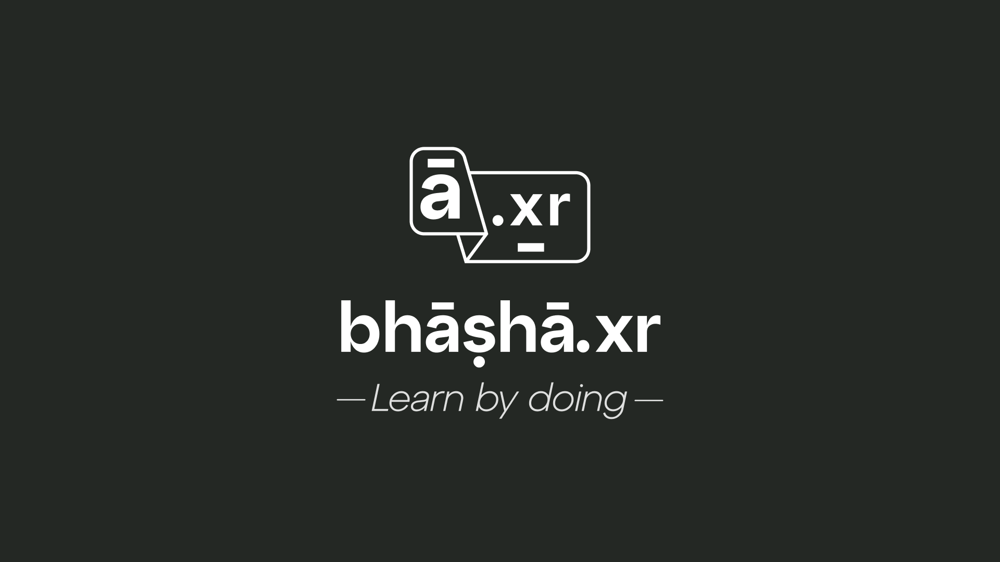
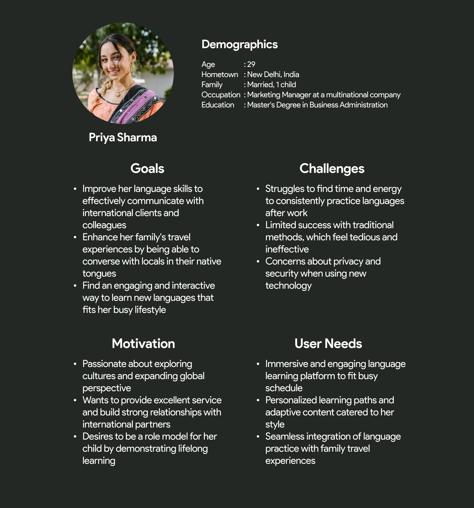

Imagine being dropped in the bustling streets of Vellore with minimal Tamil skills—that was me, during my B.Tech days, trying to make sense of the local lingo. Fast forward to today, I'm thrilled to introduce BashaXR, a VR platform designed to tackle just that: language barriers!

## 🎯 Problem Analysis

Navigating a new city is thrilling until you need to buy water and end up with a carton of milk—thanks to language mix-ups! India's linguistic diversity, while rich, can often be a hurdle for travelers and new residents alike. Traditional language courses? Too long! Quick apps? Not immersive enough!

### Market Research Highlights:

- **60%** of travelers report feeling anxious about language barriers (Travel Pulse Survey, 2023).
- **78%** express interest in quick, immersive language learning solutions (GlobalLearn Report, 2024).

Enter BashaXR: blending VR with AI to craft an engaging, 'learn-by-doing' language learning adventure.

## 🧩 Development Process

### Research Phase

We started with a diary of my language faux pas in Vellore and expanded by gathering data from over 500 travelers across India. Most shared a common wish: mastering just enough to not accidentally order spicy curry when they wanted a mild one.

### User Persona Creation

Meet our primary user personas:

> "Every traveler has a tale. With BashaXR, it's less lost-in-translation, more lost in the experience."

## 📌 User Flow and Experience Design

1. **Choose Your Adventure**: Pick from daily scenarios—be it a taxi ride or haggling at a market.
2. **Dive into VR**: Strap on your VR gear and step into a simulated Indian bazaar!
3. **Speak and Score**: Grab an uncolored apple, say "सेब" (seb) correctly, and watch it color up as you score points!

## Technical Implementation

- **VR Platform**: Developed using Unity with SteamVR integration.
- **Speech Recognition**: Implemented using Google's Speech-to-Text API with custom language models for Indian languages.
- **AI Conversation Engine**: Powered by GPT-4 for dynamic, contextual responses.

## 🎨 Visual Design

Our UI draws inspiration from India's vibrant marketplaces, making each interaction a visual treat. The primary color green symbolizes growth and renewal, while earth tones in our secondary palette evoke warmth and reliability. Typography combines a Devanagari-inspired display font for headers with a clean sans-serif for body text, enhancing readability and cultural resonance.

<iframe width="100%" height="420px" src="https://www.youtube.com/embed/eJNj0DHgdcA" frameborder="0" allowfullscreen></iframe>

## 🔦 Future and Enhanced AR Technology

As we look to the future, BashaXR is set to revolutionize language learning and real-time communication with the development of advanced AR glasses. These cutting-edge glasses will provide instant translation and suggest contextually appropriate replies, empowering users to engage in meaningful conversations without hesitation.

Below is the image of the Argument Reality Sunglasses:

## Conclusion

In a country where a few wrong words can land you a plate of extra spicy curry instead of mild, BashaXR is more than just a tool—it's your travel companion in the making. Whether you're a traveler, expat, or just curious, BashaXR promises not just to teach you a language but to transform your travel experiences.

Got Feedback or Want to Collaborate? I'm all ears! <a href="mailto:hello@vaibhavpathak.me" style="color: #BAF144; text-decoration: underline;">Drop me a message</a>
or let's connect over a chai—or should I say, tea?

<!--
# Hi there!

This Markdown file creates a page at `your-domain.com/post1/`

It probably isn't styled much, but Markdown does support:

- **bold** and _italics._
- lists
- [links](https://astro.build)
- and more!
-->
